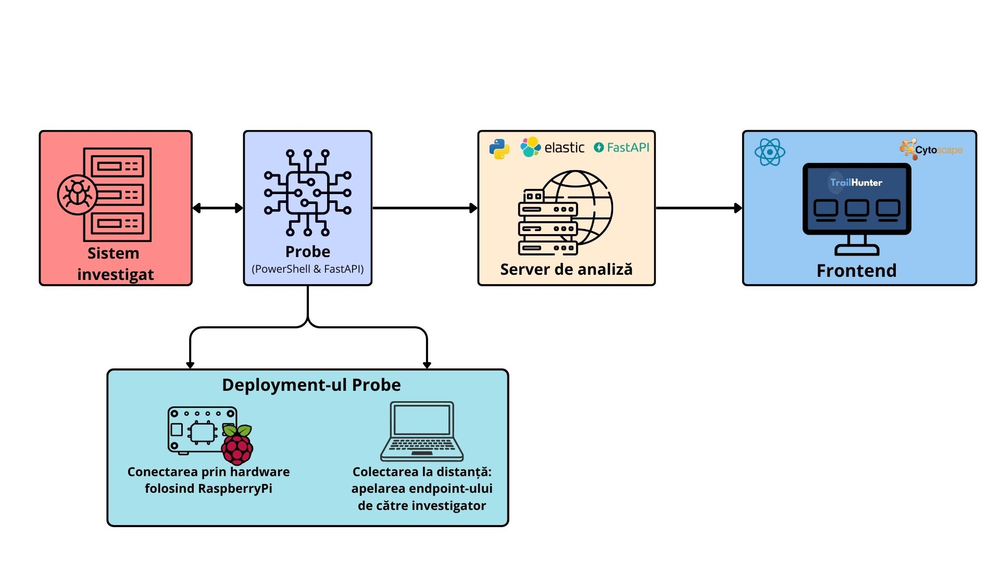
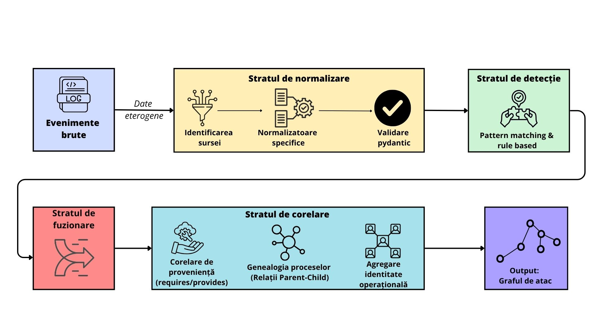

# TrailHunter
**Platformă DFIR pentru detecția și corelarea atacurilor multi-stadiu pe Windows.**

## Problema

Răspunsul la incidente de securitate pe sisteme Windows se confruntă cu o dublă provocare:

- **Volatilitatea dovezilor digitale** — datele relevante dispar la oprirea sistemului.
- **Fragmentarea telemetriei** în surse eterogene: Sysmon, Windows Security & System Logs, PowerShell Script Block Logging, Registry, Task Scheduler, WMI — fiecare cu propriul format și propriile convenții de denumire.

Pe un sistem activ, volumul de evenimente generat poate depăși **zeci de mii de intrări pe oră**. În absența unui mecanism automat de normalizare și corelare, investigatorul reconstruiește manual scenariul de atac — un proces lent și predispus la omisiuni, în special în atacurile multi-stadiu.

Niciun instrument accesibil nu parcurge întregul traseu de la telemetria brută a unui sistem compromis până la un graf cauzal al atacului, fără a presupune infrastructură de monitorizare preexistentă.

## Soluția

TrailHunter este construit pe o arhitectură **client-server** cu trei componente principale:

| Componentă | Rol |
|---|---|
| **Sondă** (PowerShell + FastAPI) | Colectează artefacte direct de pe sistemul investigat, fără dependențe instalate |
| **Server de analiză** (Python) | Normalizează, detectează și corelează evenimentele |
| **Frontend** (React + Cytoscape.js) | Expune rezultatele investigatorului sub formă de graf interactiv |

Separarea responsabilităților menține sonda ușoară pe sistemul investigat, în timp ce întreaga logică de analiză este centralizată pe server.

<p align="center">
  
</p>

### Colectarea probelor

Sonda colectează artefacte din **șase module de telemetrie**, prin două metode de deployment:

- **Hardware** — printr-un dispozitiv Raspberry Pi Zero 2W configurat simultan ca Human Interface Device și interfață de rețea peste USB (CDC NCM), care deschide automat o sesiune PowerShell privilegiată prin emulare HID și execută colectarea fără credențiale de acces la distanță.
- **Software** — prin SSH sau WinRM, prin apelarea endpoint-ului de către investigator.

Fiecare sursă este însoțită de un hash **SHA-256**, garantând integritatea probelor și un lanț de custodie verificabil conform RFC 3227 și NIST SP 800-86.

## Pipeline de analiză

Pe serverul de analiză, datele parcurg patru straturi succesive:

1. **Normalizare** — evenimentele sunt aduse la un model canonic conform **Elastic Common Schema (ECS)**, eliminând dependența de formatul sursei originale.
2. **Detecție** — un motor bazat pe reguli Python, mapate pe tehnicile **MITRE ATT&CK** și pe fazele **Cyber Kill Chain**, identifică activitate suspectă. Fiecare regulă declară explicit capabilitățile necesare (`requires`) și capabilitățile oferite (`provides`), folosite ulterior în corelare.
3. **Fuzionare** — elimină redundanțele generate de observarea aceluiași eveniment din surse diferite (ex. Sysmon + Security Logs), pe baza unui `fusion_key` determinist.
4. **Corelare** — construiește un graf orientat prin trei mecanisme complementare: contracte de capabilități **requires/provides**, genealogia proceselor (ProcessGuid + PID fallback) și agregarea identității operaționale (SID, logon ID, IP sursă). Un mecanism de veto pe conflicte de adresă IP previne contaminarea cauzală între actori diferiți.

<p align="center">
  
</p>

### Output-ul final

Rezultatul este vizualizat interactiv prin **Cytoscape.js**, stratificat pe fazele Kill Chain (axa verticală) și ordonat cronologic (axa orizontală), astfel încât progresia atacului poate fi citită de sus în jos. Selectarea unui nod expune metadatele complete ale detecției: reguli implicate, evenimente sursă normalizate, contracte de capabilități și fusion key.

## Rezultate

Validarea pe trei scenarii de atac simulate pe DVWA (Damn Vulnerable Web Application), executate de doi atacatori independenți pe Kali Linux:

| Metric | Rezultat |
|---|---|
| Evenimente brute colectate (scenariu combinat) | 222.407 |
| Alerte generate de motorul de detecție | 227 |
| Noduri după fuzionare | 64 |
| Tehnici ATT&CK detectate corect | 10 / 11 |
| Fals pozitive după tuning | 0 |
| Actori separați corect în scenariu combinat | 2 / 2 |

Cei doi atacatori, operând simultan asupra aceluiași sistem cu același vector de intrare, au fost separați în grafuri de atac independente identice cu cele din scenariile individuale.

## De ce TrailHunter?

| Caracteristică | Velociraptor | KAPE | Elastic SIEM | TrailHunter |
|---|---|---|---|---|
| Open-source | ✅ | Parțial | Parțial | ✅ |
| Colectare agentless | ✅ | ✅ | ❌ | ✅ |
| Normalizare ECS | ✅ | ❌ | ✅ | ✅ |
| Detecție bazată pe reguli | ✅ | ❌ | ✅ | ✅ |
| Corelare cross-sursă | Limitată | ❌ | ✅ | ✅ |
| Graf de atac vizual | ❌ | ❌ | Parțial | ✅ |
| Mapare MITRE ATT&CK + Kill Chain | Parțial | ❌ | ✅ | ✅ |
| Fără infrastructură preexistentă | ✅ | ✅ | ❌ | ✅ |

## Getting Started

### Cerințe

- Python 3.10+
- Node.js 18+
- Windows cu Sysmon instalat și configurat (configurație recomandată în `/configs/sysmon-config.xml`)

### Instalare server de analiză

```bash
git clone https://github.com/your-username/trailhunter
cd trailhunter/server
pip install -r requirements.txt
uvicorn main:app --host 0.0.0.0 --port 8000
```

### Instalare frontend

```bash
cd trailhunter/frontend
npm install
npm run dev
```

### Colectare pe sistemul investigat

```powershell
irm http://<server-ip>:8000/collector.ps1 | iex
```

Scriptul descarcă și execută colectarea în memorie, fără a lăsa componente persistente pe sistemul investigat.

## Tech Stack

`PowerShell` · `Python` · `FastAPI` · `Pydantic` · `NetworkX` · `React` · `TypeScript` · `Cytoscape.js` · `SQLite` · `SQLAlchemy` · `Raspberry Pi Zero 2W`